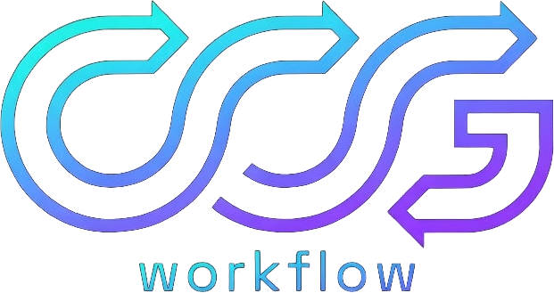

# CCG - Claude + Codex + Gemini 多模型协作
# CCG - Claude + Codex + Gemini Multi-Model Collaboration

<div align="center">



[](https://github.com/fengshao1227/ccg-workflow)
[](https://www.npmjs.com/package/ccg-workflow)
[](https://www.npmjs.com/package/ccg-workflow)
[](https://opensource.org/licenses/MIT)
[](https://claude.ai/code)
[]()
[](https://x.com/CCG_Workflow)

[](https://ccg.fengshao1227.com/)

[简体中文](./README.zh-CN.md) | English | [**完整文档**](https://ccg.fengshao1227.com/)

</div>

## ♥️ Sponsor

[](https://share.302.ai/oUDqQ6)

[302.AI](https://share.302.ai/oUDqQ6) is a pay-as-you-go enterprise AI resource hub that offers the latest and most comprehensive AI models and APIs on the market, along with a variety of ready-to-use online AI applications.

---

[](https://notebooklmremover.org)

[NotebookLM Remover](https://notebooklmremover.org) — 免费浏览器本地 AI 水印去除工具。支持视频、PDF、PPTX、信息图、播客等全格式，100% 隐私，离线可用。

---

CCG 是 Claude Code 的工作流引擎。它编排多个 AI 模型（Codex、Gemini、Claude），通过 Hook 状态追踪、自动策略选择和 Agent Teams 并行执行来完成开发任务。

## v3.0 重大更新

v3.0 从底层重写。一个命令替代 29 个。

- `/ccg:go` — 用自然语言描述任务，引擎自动分析意图、选择策略、执行到底。
- **Hook 引擎** — 每轮注入任务状态，即使上下文被压缩也不丢。会话开始时注入完整项目上下文。
- **Task 持久化** — 中等以上复杂度任务创建 `.ccg/tasks/`，阶段门控强制 HARD STOP 检查点。
- **Agent Teams** — 大型任务通过 TeamCreate 并行 spawn 多个 Builder。每个 Builder 有独立文件所有权。
- **质量关卡** — `verify-security`、`verify-quality`、`verify-change` 作为 Skill 在策略验证阶段强制调用。
- **域知识 Hook** — 消息涉及安全、缓存、RAG 等关键词时，相关知识文件自动注入上下文。
- **Codex 主导模式** — 用 Codex CLI 作为主编排器，Codex 自己写代码，同时调度 Gemini + Claude 做分析和审查。菜单 `X` 选项安装。

## 快速开始

```bash
npx ccg-workflow
```

需要 Node.js 20+ 和 Claude Code CLI。Codex CLI 和 Gemini CLI 可选（启用多模型功能）。

安装器 4 步：API 配置 → 模型路由 → MCP 工具 → 性能模式。新用户有精简流程，默认值开箱即用。

## 工作原理

```
你: /ccg:go 给这个 API 加 JWT 认证

CCG 引擎:
  1. 读取项目上下文（git、技术栈、文件结构）
  2. 分类: feature / L 复杂度 / backend / high 风险
  3. 选择策略: full-collaborate
  4. 创建 .ccg/tasks/add-jwt-auth/task.json
  5. 双模型并行分析（Codex + Gemini）
  6. 产出计划 → HARD STOP 等你审批
  7. spawn Agent Teams Builder 并行实施
  8. 质量关卡 + 双模型交叉审查
  9. 输出结果

每轮 Hook 注入:
  <ccg-state>
  Task: add-jwt-auth (in_progress)
  Strategy: full-collaborate
  Phase: 4-implementation
  Next: Layer 1 Builders 执行中
  </ccg-state>
```

## 策略体系

引擎根据任务类型和复杂度自动选择策略：

| 策略 | 场景 | 外部模型 | Teams |
|------|------|---------|-------|
| direct-fix | 简单 bug，单文件 | 无 | 无 |
| quick-implement | 小功能，范围清晰 | 无 | 无 |
| guided-develop | 中等功能，需要规划 | 单模型 | 无 |
| full-collaborate | 复杂功能，跨模块 | 双模型并行 | 强制 |
| debug-investigate | 复杂 bug，原因不明 | 双模型诊断 | 无 |
| refactor-safely | 代码重构 | 双模型审查 | 无 |
| deep-research | 技术研究、方案对比 | 双模型探索 | 无 |
| optimize-measure | 性能优化 | 可选 | 无 |
| review-audit | 代码审查 | 双模型交叉 | 无 |
| git-action | commit、rollback 等 | 无 | 无 |

简单任务零开销快速执行。复杂任务启动完整引擎。

## 命令

v3.0 默认安装 13 个命令。旧版模式额外安装 18 个。

### 核心

| 命令 | 说明 |
|------|------|
| `/ccg:go` | 智能入口 — 描述任务，引擎自动处理 |

### Git 工具

| 命令 | 说明 |
|------|------|
| `/ccg:commit` | 智能 conventional commit |
| `/ccg:rollback` | 交互式回滚 |
| `/ccg:clean-branches` | 清理已合并分支 |
| `/ccg:worktree` | Worktree 管理 |

### 项目

| 命令 | 说明 |
|------|------|
| `/ccg:init` | 初始化项目 CLAUDE.md |
| `/ccg:context` | 项目上下文管理 |

### OpenSpec

| 命令 | 说明 |
|------|------|
| `/ccg:spec-init` | 初始化 OPSX 环境 |
| `/ccg:spec-research` | 需求 → 约束集 |
| `/ccg:spec-plan` | 零决策可执行计划 |
| `/ccg:spec-impl` | 按规范实施 |
| `/ccg:spec-review` | 双模型交叉审查 |

## Hook 引擎

CCG 在 `~/.claude/settings.json` 注册 4 个 Hook：

| Hook | 事件 | 作用 |
|------|------|------|
| workflow-state.js | UserPromptSubmit | 每轮注入任务状态面包屑 |
| session-start.js | SessionStart | 会话开始/压缩时注入完整项目上下文 |
| subagent-context.js | PreToolUse | Team spawn 时通过 `updatedInput` 直接注入子 agent prompt；codeagent-wrapper 时注入主控上下文 |
| skill-router.js | UserPromptSubmit | 检测域关键词，自动注入知识文件 |

纯 JavaScript，零依赖，失败时静默退出。

## Task 系统

中等以上复杂度任务创建持久化目录：

```
.ccg/tasks/add-jwt-auth/
├── task.json         # 状态、策略、当前阶段、门控
├── requirements.md   # 增强后的需求
├── plan.md           # 审批后的计划
├── context.jsonl     # 子 Agent spec 注入列表
├── review.md         # 审查结果
└── research/         # 研究成果
```

workflow-state Hook 每轮读取 task.json 注入状态。上下文压缩后 session-start 重新注入。状态不会丢失。

## Spec 系统

项目级编码规范在 `.ccg/spec/`：

```
.ccg/spec/
├── backend/index.md    # 后端规范
├── frontend/index.md   # 前端规范
└── guides/index.md     # 跨模块指南
```

subagent-context Hook 读取 `context.jsonl` 将相关 spec 文件注入到 codeagent-wrapper 调用和 Team spawn 中。子 Agent 自动遵循项目规范。

## 配置

```
~/.claude/
├── commands/ccg/          # 斜杠命令
├── hooks/ccg/             # Hook 脚本（4 个）
├── .ccg/
│   ├── config.toml        # 模型路由、MCP、性能
│   ├── engine/            # 策略文件 + 模型路由器
│   └── prompts/           # 专家提示词
├── skills/ccg/            # 质量关卡 + 域知识
└── bin/codeagent-wrapper  # 多模型执行桥
```

### 环境变量

在 `~/.claude/settings.json` 的 `"env"` 中设置：

| 变量 | 默认值 | 说明 |
|------|--------|------|
| `CODEX_TIMEOUT` | `7200` | Wrapper 超时（秒） |
| `CLAUDE_CODE_EXPERIMENTAL_AGENT_TEAMS` | 未设置 | 设为 `1` 启用 Agent Teams 并行 |

## 更新 / 卸载

```bash
npx ccg-workflow@latest     # 更新
npx ccg-workflow            # 菜单中选"卸载"
```

## 致谢

- [cexll/myclaude](https://github.com/cexll/myclaude) — codeagent-wrapper 灵感
- [UfoMiao/zcf](https://github.com/UfoMiao/zcf) — Git 工具参考
- [mindfold-ai/Trellis](https://github.com/mindfold-ai/Trellis) — Hook 工作流状态模式
- [ace-tool](https://linux.do/t/topic/1344562) — MCP 代码检索

## 贡献者

<!-- readme: contributors -start -->
<table>
<tr>
    <td align="center"><a href="https://github.com/fengshao1227"><br /><sub><b>fengshao1227</b></sub></a></td>
    <td align="center"><a href="https://github.com/SXP-Simon"><br /><sub><b>SXP-Simon</b></sub></a></td>
    <td align="center"><a href="https://github.com/RebornQ"><br /><sub><b>RebornQ</b></sub></a></td>
    <td align="center"><a href="https://github.com/Sakuranda"><br /><sub><b>Sakuranda</b></sub></a></td>
    <td align="center"><a href="https://github.com/Mriris"><br /><sub><b>Mriris</b></sub></a></td>
    <td align="center"><a href="https://github.com/23q3"><br /><sub><b>23q3</b></sub></a></td>
    <td align="center"><a href="https://github.com/MrNine-666"><br /><sub><b>MrNine-666</b></sub></a></td>
</tr>
<tr>
    <td align="center"><a href="https://github.com/GGzili"><br /><sub><b>GGzili</b></sub></a></td>
</tr>
</table>
<!-- readme: contributors -end -->

## 联系

- **X (Twitter)**: [@CCG_Workflow](https://x.com/CCG_Workflow)
- **Email**: [fengshao1227@gmail.com](mailto:fengshao1227@gmail.com)
- **Issues**: [GitHub Issues](https://github.com/fengshao1227/ccg-workflow/issues)
- **社区**: [Linux.do](https://linux.do)

## License

MIT

---

v3.1.7 | [Issues](https://github.com/fengshao1227/ccg-workflow/issues) | [Contributing](./CONTRIBUTING.md)
